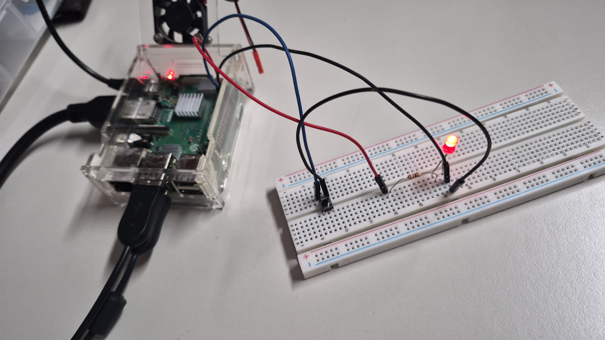

# SEL0337 — Projetos em Sistemas Embarcados
## Prática 3: Introdução à programação de alto nível com GPIO
### Checkpoint 3 — Threads, Botão e Controle de Frequência

**Integrantes:**
- Felipe Assis Bernardes Falvo — Nº USP: 15004433
- Kayke Malaquias Gregorio — Nº USP: 15651561

---

## 1. Introdução

Esse diretório contém a solução do **Checkpoint 3** da Prática 3.

Nessa parte, foi desenvolvido um programa utilizando a Raspberry Pi, um LED e um botão. O LED fica piscando e o botão tem a função de alternar entre dois modos:

- **Modo lento:** LED pisca a cada 1 segundo;
- **Modo rápido:** LED pisca a cada 0,2 segundo.

Além disso, o programa executa uma contagem regressiva de 15 segundos em uma thread separada, enquanto o LED continua piscando. Para controlar o acesso à variável compartilhada entre as threads, foi utilizado um `Lock` da biblioteca `threading`.

---

## 2. Objetivo

O objetivo dessa etapa é utilizar threads, interrupções de GPIO e um botão para alterar o comportamento de um LED. Assim, o botão é utilizado para alternar entre as duas velocidades de piscagem do LED.

Ao mesmo tempo, uma contagem regressiva de 15 segundos é executada em uma thread separada e apresenta no terminal o modo atual e o tempo restante.

---

## 3. Montagem

Foram utilizados os seguintes equipamentos:

- Raspberry Pi;
- Protoboard;
- LED (pino 11);
- Resistor;
- Botão (pino 13);
- Jumpers.

Foi utilizada a numeração **BOARD**, logo os números correspondem aos pinos físicos da Raspberry Pi. O programa está funcionando como está no vídeo **video_prova_check3.mp4** e o circuito está representado na figura abaixo:



---

## 4. Funcionamento

O programa começa configurando o LED como saída e o botão como entrada com *pull-up*. Além disso, a variável `tempo_pisca = 1` define inicialmente o tempo de cada estado do LED, correspondendo ao modo lento.

Quando o botão é pressionado, o programa alterna entre:

```text
Modo lento:  1 segundo
Modo rápido: 0,2 segundo
```

A alteração é realizada por meio de uma interrupção.

---

## 5. Uso do botão

O botão é configurado como entrada utilizando o resistor interno de *pull-up*:

```python
GPIO.setup(botao, GPIO.IN, pull_up_down=GPIO.PUD_UP)
```

Também é configurada a interrupção na borda de descida:

```python
GPIO.add_event_detect(
    botao,
    GPIO.FALLING,
    callback=mudar_frequencia,
    bouncetime=300
)
```

Quando o botão é pressionado, a função `mudar_frequencia()` é executada.

O `bouncetime=300` serve para evitar que o sistema registre vários cliques quando o botão é pressionado apenas uma vez.

---

## 6. Threads

O programa utiliza uma thread separada para executar a contagem regressiva.

A thread é criada com:

```python
t_tempo = threading.Thread(
    target=thread_contagem,
    args=(15,)
)
```

A contagem começa em 15 segundos e vai até 0. Enquanto isso, a thread principal continua responsável pelo funcionamento do LED.

Dessa forma, as duas tarefas podem acontecer ao mesmo tempo: a thread principal controla o LED, enquanto a thread secundária realiza a contagem regressiva de 15 segundos.

---

## 7. Uso do Mutex

Como as diferentes partes do programa podem acessar a variável `tempo_pisca`, foi utilizado um `Lock`:

```python
mutex = threading.Lock()
```

O `mutex` protege o acesso à variável compartilhada, evitando que duas partes do programa acessem ou alterem seu valor ao mesmo tempo.

Por exemplo:

```python
with mutex:
    tempo_atual = tempo_pisca
```

e:

```python
with mutex:
    opcao = "Opcao 1 (Lento)" if tempo_pisca == 1 else "Opcao 2 (Rapido)"
```

---

## 8. Contagem regressiva

A função `thread_contagem()` realiza uma contagem regressiva de 15 até 0 segundos.

O tempo é transformado em minutos e segundos utilizando:

```python
minutos, segundos = divmod(t, 60)
```

Durante a contagem, o terminal mostra o modo atual e o tempo restante.

Quando a contagem chega ao final, a mensagem:

```text
FIM
```

é apresentada no terminal.

---

## 9. Controle do LED

O LED é controlado pela thread principal.

Para ligar o LED, é utilizado:

```python
GPIO.output(pino_led, GPIO.HIGH)
```

Depois do tempo definido, ele é desligado:

```python
GPIO.output(pino_led, GPIO.LOW)
```

O LED pisca de acordo com o modo selecionado:

- **Modo lento:** o LED fica ligado por 1 segundo e desligado por 1 segundo.
- **Modo rápido:** o LED fica ligado por 0,2 segundo e desligado por 0,2 segundo.

Ao apertar o botão, o programa alterna entre os dois modos.

## 10. Threads vs Processos (Multithreading vs Multiprocessing)

Para essa aplicação, foram utilizadas threads porque as tarefas (piscar o LED e contar o tempo) dependem de temporizações simples e compartilham a mesma variável na memória (`tempo_pisca`). 

Se fossem usados processos (`multiprocessing`), cada um teria sua própria memória isolada. Isso exigiria formas de comunicação entre processos (como memória compartilhada ou filas) só para passar o novo valor de tempo do LED.
